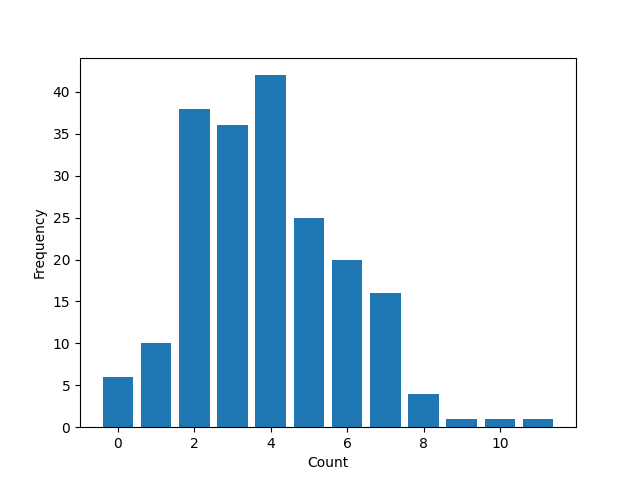

### Poisson Statistics of Background Radiation
It all started with *bang*  

### Methodology
Using a Geiger Counter. We measured the amount of counts registered per time frame  

Raw Data Image of Counts per .1 min

