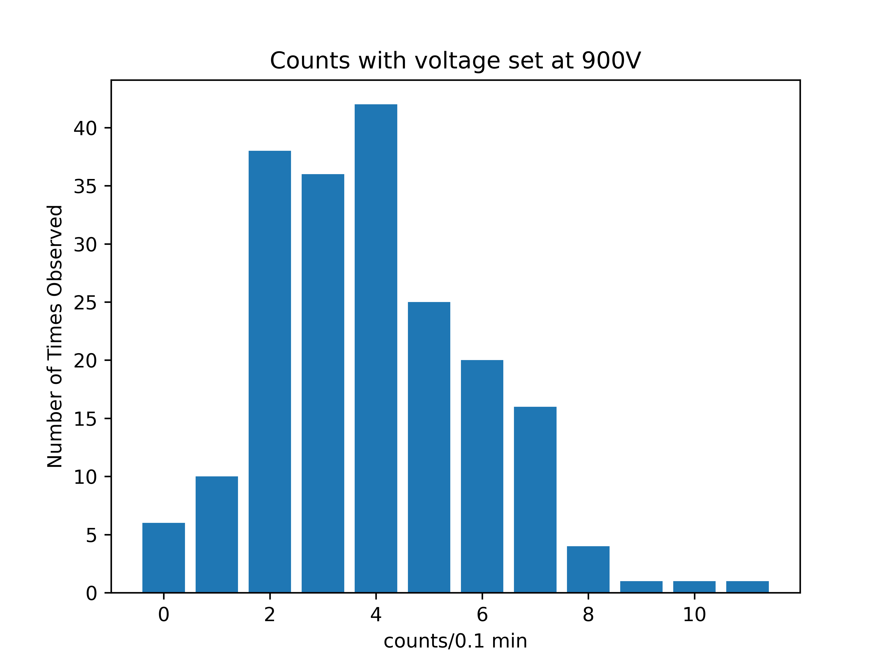
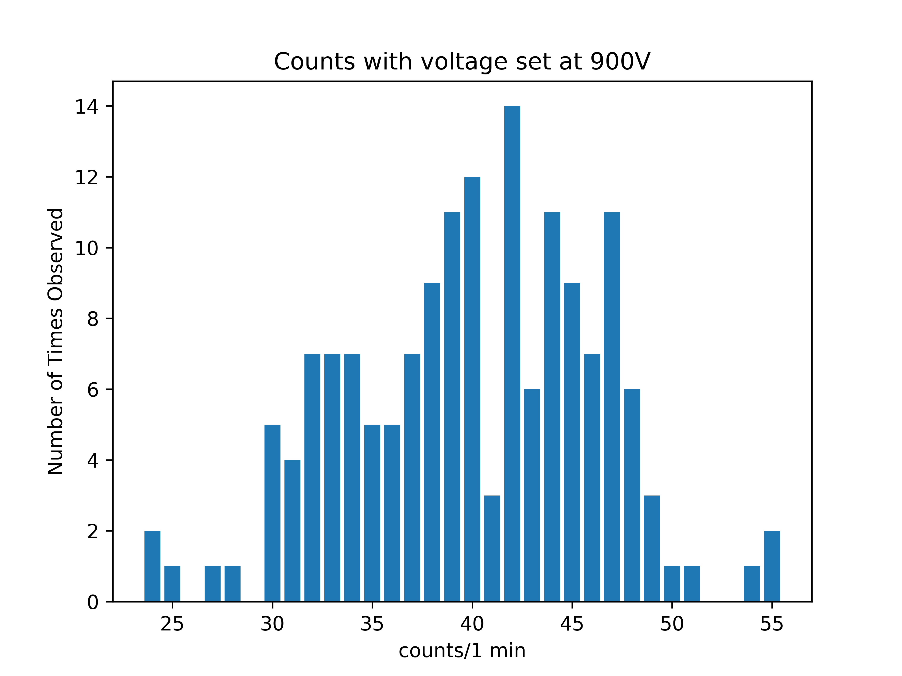
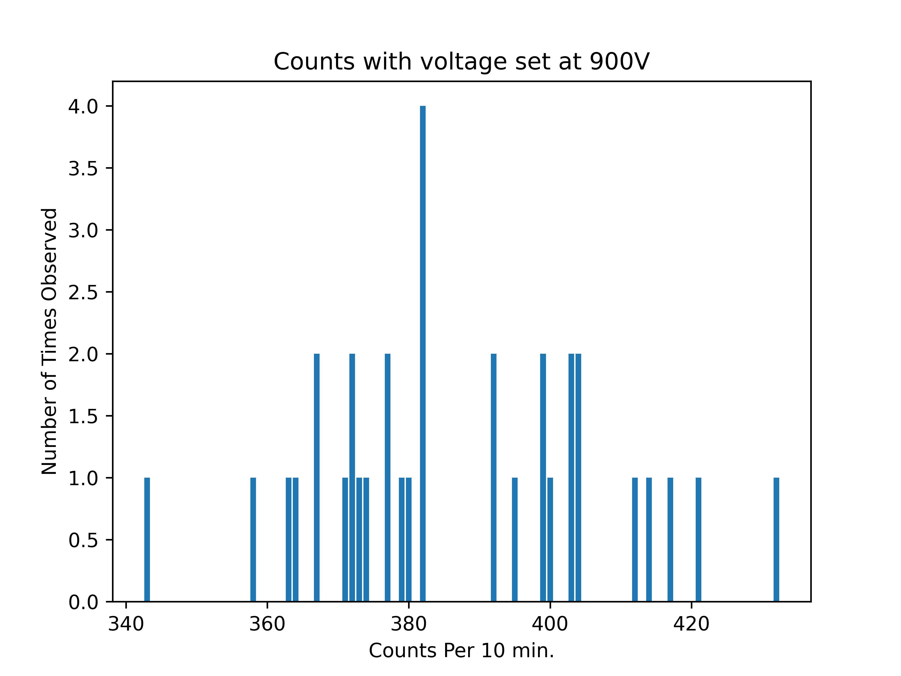

### Poisson Statistics of Background Radiation
all we need is chi square of the gaussian
It all started with *bang*  

## Data
Using a Geiger Counter. We measured the amount of counts registered per time frame  
### Raw Data Histograms
Raw Data Image of Counts per .1 min

 
Raw Data Image of Counts per 1 min

 
Raw Data Image of Counts per 10 min

